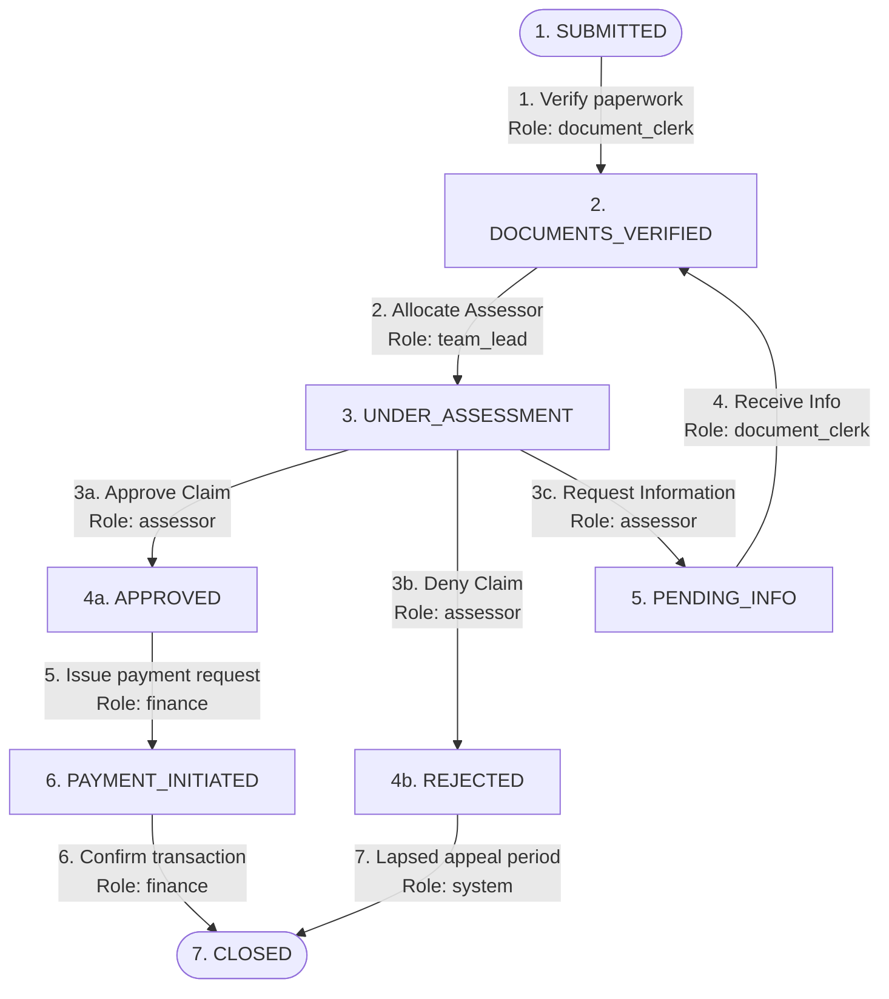

# Claims Workflow Orchestrator (English)

The **Claims Workflow Orchestrator** is a robust, state-of-the-art, config-driven state machine application built with **NestJS** on the backend and **Next.js** on the frontend, using **MySQL** as its persistent database layer. 

This system orchestrates the complete lifecycle of insurance claims, strictly validating dynamic business rules, enforcing Segregation of Duties (SoD), detecting loop limits, and providing a completely tamper-proof, immutable digital audit trail.

---

## 🏢 Business Logic & Operational Roles

An insurance claim moves through a sensitive operational lifecycle. Improper state transitions (e.g. paying an unassessed claim) lead to financial leakage or compliance penalties. 



### Operational Roles & Segregation of Duties
To prevent internal fraud, access is isolated dynamically by role:
- **`document_clerk` (Clerk)**: Handles basic reception work (`SUBMITTED ➔ DOCUMENTS_VERIFIED`) and ingests incoming files (`PENDING_INFO ➔ DOCUMENTS_VERIFIED`). Holds no medical or financial review authority.
- **`team_lead` (Manager)**: Manages work allocations and assigns clinical assessors to claims (`DOCUMENTS_VERIFIED ➔ UNDER_ASSESSMENT`).
- **`assessor` (Clinical Auditor)**: Audits clinical details against policy rules. Authorizes approval, rejection, or requests more information (`UNDER_ASSESSMENT ➔ APPROVED / REJECTED / PENDING_INFO`).
- **`finance` (Finance Department)**: Manages cash disbursements and bank transfers (`APPROVED ➔ PAYMENT_INITIATED ➔ CLOSED`).
- **`system` (Automated System)**: Executes time-lapsed rules such as archiving rejected claims after their appeal period has expired (`REJECTED ➔ CLOSED`).

---

## ⚙️ Core Architecture & Safeguards

### 1. Dynamic Config-Driven State Machine
Rather than hardcoding transition branches, the state machine is entirely configured in `/config/workflow-config.json` inside the backend. Adding new states or transitions requires **only config modifications** with zero source code edits.

### 2. Precondition Gates
Before committing a transition, the engine evaluates strict rules:
- **Approval**: The clinical assessment report must be marked complete, and the claim request amount (`claimAmount`) must be less than or equal to the member's policy limit (`policyLimit`).
- **Rejection**: A valid text reason for the rejection (`rejectionReason`) must be provided.
- **Information Request**: A detailed description of the missing documents (`missingInfoDescription`) must be supplied.

### 3. Loop Guardrails (Max 3 Cycles Limit)
To prevent infinite request loops, the system tracks the `UNDER_ASSESSMENT ➔ PENDING_INFO ➔ DOCUMENTS_VERIFIED ➔ UNDER_ASSESSMENT` cycle. The engine allows a maximum of **3 cycles**. On the **4th attempt**, it blocks the transition and throws a strict `400 BadRequestException`: `"Maximum information requests exceeded — escalate to team lead"`.

### 4. Immutable Auditing Log (TAMPER-PROOF)
- Log entries are generated automatically and saved to the MySQL database.
- Once created, log objects are **deeply frozen in memory** (`Object.freeze()`), making it impossible for memory manipulation to alter them.
- Reading logs returns decoupled clones, ensuring absolute historical data integrity.

---

## ❓ Architectural Q&A

### Q1: How does the system handle database deadlocks?
- **The Issue**: Originally, `ClaimsService.transition()` operated inside a database transaction, but `AuditTrailService.create()` was saving logs using its own separate repository connection. Under high-speed parallel operations (like Scenario playbacks), these separate connections conflicted over database locks, causing MySQL to deadlock and throw a `Lock wait timeout exceeded` error after 50 seconds.
- **The Solution**: We refactored the backend to pass the transactional `entityManager` context from the parent service through the workflow engine down to the audit trail repository. By sharing a single atomic database connection thread, deadlocks are completely eliminated, and transactions run instantly in under 10ms.

### Q2: How are preconditions validated dynamically?
The engine features a recursive precondition validator supporting `EQUALS`, `NOT_EMPTY`, `LESS_THAN_OR_EQUAL_FIELD`, and complex `OR` logical gates. When a transition is triggered, the context metadata is evaluated dynamically against these rules inside the engine.

---

## 💻 Tech Stack & Installation

- **Backend**: NestJS, TypeORM, MySQL, Jest
- **Frontend**: Next.js, Vanilla CSS (Dark glassmorphism neon UI), Fetch Client

### Backend Setup
```bash
cd claims-backend
npm install
npm run test           # Executes 18 robust Jest integration tests
npm run start:dev      # Starts on http://localhost:3001
```

### Frontend Setup
```bash
cd claims-frontend
npm install
npm run build          # Compiles cleanly with 0 warnings
npm run dev            # Starts on http://localhost:3000
```
