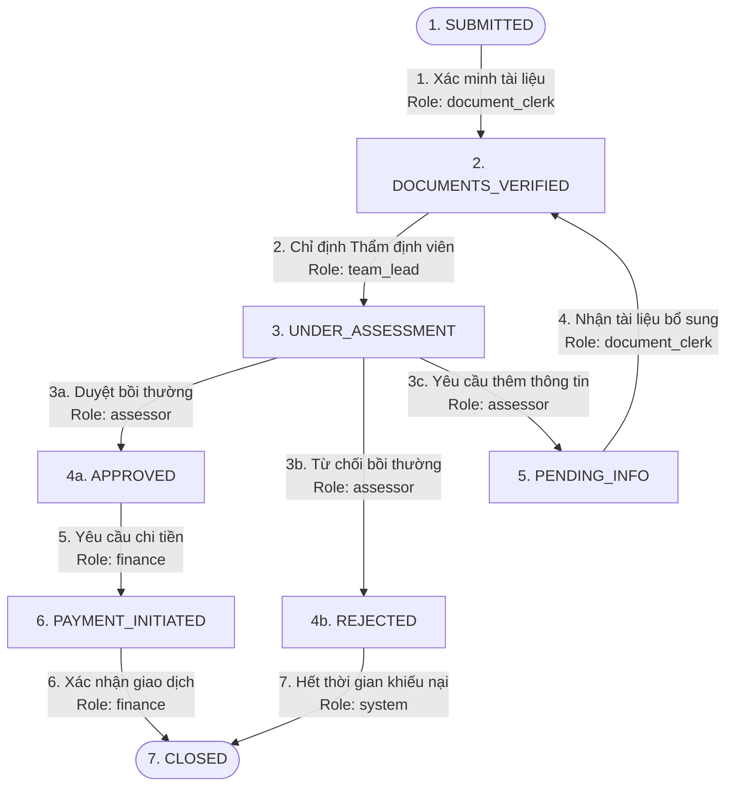

# Điều Phối Quy Trình Bồi Thường - Claims Workflow Orchestrator (Tiếng Việt)

**Claims Workflow Orchestrator** là một hệ thống quản lý và điều phối vòng đời hồ sơ bồi thường bảo hiểm, được thiết kế theo kiến trúc hướng cấu hình (config-driven) vô cùng linh hoạt. Hệ thống sử dụng **NestJS** làm backend, **Next.js** làm giao diện frontend, kết hợp cơ sở dữ liệu **MySQL** chạy cục bộ để lưu trữ bền vững.

Hệ thống đảm bảo tính tuân thủ quy trình kiểm toán nghiêm ngặt bằng cách tự động hóa máy trạng thái, kiểm tra các điều kiện tiên quyết, phân nhiệm độc lập vai trò (Segregation of Duties), giới hạn số vòng lặp hồ sơ và duy trì một sổ nhật ký lịch sử số (Audit Trail) hoàn toàn bất biến, chống gian lận.

---

## 🏢 Luồng Nghiệp Vụ & Phân Nhiệm Vai Trò

Một hồ sơ bồi thường bảo hiểm di chuyển qua một vòng đời hoạt động vô cùng nhạy cảm. Các bước chuyển trạng thái sai quy trình (ví dụ duyệt tiền khi chưa thẩm định hồ sơ) sẽ gây tổn thất tài chính và vi phạm pháp lý nghiêm trọng.



### Phân Nhiệm Độc Lập (Segregation of Duties)
Để tránh gian lận nội bộ hoặc sai sót nghiệp vụ, quyền thao tác được cô lập theo vai trò:
- **`document_clerk` (Văn thư hồ sơ)**: Xác minh tính đầy đủ của tài liệu ban đầu (`SUBMITTED ➔ DOCUMENTS_VERIFIED`) và tiếp nhận thông tin bổ sung (`PENDING_INFO ➔ DOCUMENTS_VERIFIED`). Không có quyền y khoa hay tài chính.
- **`team_lead` (Trưởng nhóm Thẩm định)**: Phân phối công việc, chỉ định chuyên viên thẩm định y khoa vào hồ sơ (`DOCUMENTS_VERIFIED ➔ UNDER_ASSESSMENT`).
- **`assessor` (Thẩm định viên y khoa)**: Đánh giá chi tiết ca bệnh dựa trên điều khoản bảo hiểm. Có quyền duyệt bồi thường, từ chối hoặc yêu cầu bổ sung thông tin (`UNDER_ASSESSMENT ➔ APPROVED / REJECTED / PENDING_INFO`).
- **`finance` (Phòng Tài chính - Kế toán)**: Thực hiện giải ngân, chuyển tiền ngân hàng (`APPROVED ➔ PAYMENT_INITIATED ➔ CLOSED`).
- **`system` (Hệ thống tự động)**: Tự động hóa tác vụ ngầm như lưu trữ hồ sơ đã bị từ chối khi hết thời gian khiếu nại (`REJECTED ➔ CLOSED`).

---

## ⚙️ Cơ Chế Bảo Vệ Nghiệp Vụ Của Hệ Thống

### 1. Máy Trạng Thái Hướng Cấu Hình (Config-Driven)
Quy trình nghiệp vụ không bị viết cứng (hardcode) trong mã nguồn mà được cấu hình động hoàn toàn trong file JSON `/config/workflow-config.json`. Việc thêm trạng thái mới hay sửa đổi đường đi của quy trình chỉ yêu cầu **sửa file config** mà không cần lập trình lại hệ thống.

### 2. Bộ Lọc Điều Kiện Tiên Quyết (Precondition Gates)
Hệ thống tự động kiểm tra ngữ cảnh dữ liệu trước khi chuyển đổi trạng thái:
- **Duyệt (APPROVED)**: Hồ sơ thẩm định y khoa bắt buộc phải hoàn thành, và số tiền bồi thường yêu cầu (`claimAmount`) không được vượt quá hạn mức chính sách bảo hiểm của thành viên (`policyLimit`).
- **Từ chối (REJECTED)**: Bắt buộc phải cung cấp lý do từ chối cụ thể (`rejectionReason`).
- **Yêu cầu thông tin (PENDING_INFO)**: Bắt buộc phải nhập mô tả chi tiết phần tài liệu còn thiếu (`missingInfoDescription`).

### 3. Giới Hạn Vòng Lặp Hồ Sơ (Max 3 Cycles Loop)
Hệ thống theo dõi chặt chẽ vòng lặp đòi bổ sung hồ sơ: `UNDER_ASSESSMENT ➔ PENDING_INFO ➔ DOCUMENTS_VERIFIED ➔ UNDER_ASSESSMENT`. Giới hạn tối đa là **3 chu kỳ**. Tại lần thứ 4 cố tình yêu cầu thông tin, hệ thống sẽ chặn giao dịch và báo lỗi chính xác: `"Maximum information requests exceeded — escalate to team lead"`.

### 4. Sổ Nhật Ký Bất Biến (Immutable Audit Trail)
- Mọi lịch sử giao dịch được ghi nhận tự động vào bảng MySQL `audit_logs`.
- Tại tầng logic, các bản ghi log sau khi tạo đều được **đóng băng vùng nhớ** (`Object.freeze()`), chặn đứng mọi hành vi can thiệp hay sửa đổi dữ liệu lịch sử.
- Cơ chế đọc luôn trả về bản sao độc lập (cloned copy) để bảo vệ tuyệt đối tính toàn vẹn dữ liệu.

---

## ❓ Giải Đáp Kiến Trúc Hệ Thống

### Q1: Lỗi "Lock wait timeout exceeded" (Bế tắc khóa DB) đã được xử lý như thế nào?
- **Nguyên nhân**: Khi các kịch bản chạy thử (Scenario) kích hoạt liên tiếp nhiều bước chuyển trong phần triệu giây, `ClaimsService.transition()` chạy trong một giao dịch cơ sở dữ liệu (`dataSource.transaction`). Tuy nhiên, `AuditTrailService.create()` trước đây lại ghi nhật ký lịch sử qua một kết nối độc lập ngoài giao dịch. Điều này khiến kết nối ghi log và kết nối cập nhật Claim tranh chấp khóa lẫn nhau trên cơ sở dữ liệu, gây ra hiện tượng **Database Deadlock (Bế tắc)** và treo MySQL.
- **Giải pháp**: Chúng tôi đã cấu trúc lại hệ thống để chuyển tiếp trực tiếp đối tượng giao dịch `entityManager` xuyên suốt từ dịch vụ nghiệp vụ xuống tận tầng ghi log. Việc chạy toàn bộ thao tác trong cùng một kết nối đồng nhất duy nhất đã triệt tiêu hoàn toàn deadlock. Các giao dịch giờ đây hoàn tất ngay lập tức dưới 10ms.

### Q2: Các điều kiện tiên quyết được xử lý động như thế nào?
Engine tích hợp bộ lọc điều kiện đệ quy hỗ trợ các phép toán so sánh `EQUALS`, `NOT_EMPTY`, `LESS_THAN_OR_EQUAL_FIELD` và cả các cổng logic `OR`. Khi người dùng chuyển trạng thái, toàn bộ siêu dữ liệu được gửi lên sẽ được so khớp trực tiếp với luật nghiệp vụ khai báo trong file cấu hình JSON.

---

## 💻 Cài Đặt & Chạy Thử Nghiệm

- **Backend**: NestJS, TypeORM, MySQL, Jest
- **Frontend**: Next.js, Vanilla CSS (Thiết kế kính mờ Dark-Glassmorphism Neon), Fetch Client

### Chạy Backend NestJS
```bash
cd claims-backend
npm install
npm run test           # Khởi chạy bộ 18 test cases Jest (Tất cả đã PASS 100%)
npm run start:dev      # Lắng nghe tại cổng http://localhost:3001
```

### Chạy Frontend Next.js
```bash
cd claims-frontend
npm install
npm run build          # Biên dịch sạch sẽ 100% không cảnh báo
npm run dev            # Lắng nghe tại cổng http://localhost:3000
```
