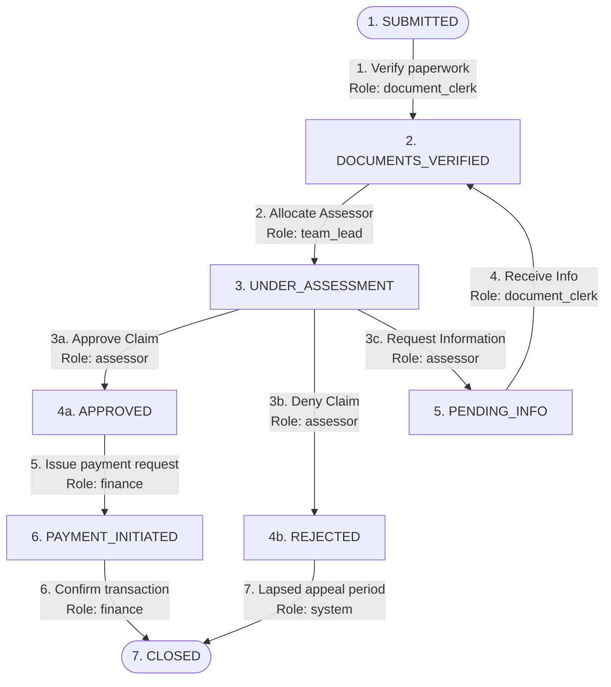

# Claims Workflow Orchestrator - Backend (NestJS)

The Claims Workflow Orchestrator is a robust, config-driven state machine backend built with **NestJS** and strictly configured in **TypeScript**. It governs the complex, highly sensitive operational lifecycle of insurance claims, guaranteeing high auditing compliance, prevention of internal and external fraud, and automated SLA boundaries.

---

## 🏢 Business Logic & Operational Flows

In health and commercial insurance infrastructure, an insurance claim represents a member's request for payment for covered services. Managing its lifecycle is a critical risk area: an incorrect transition—such as issuing a payment before clinical files are verified or approving an amount exceeding a member's annual policy limit—can lead to severe compliance violations, legal penalties, or financial leaks.

To secure this, our engine implements strict **Segregation of Duties (SoD)**, dynamic **Precondition Gates**, and an **Immutable Digital Audit Trail**.



### 1. The Claim Lifecycle States
* **SUBMITTED (Claim Received)**: The initial entry state. The claim is locked from review until basic paperwork and required files are verified.
* **DOCUMENTS_VERIFIED (Hồ Sơ Hợp Lệ)**: A clerk has verified that all clinical and identity files are present. The claim is now ready to be assigned for medical review.
* **UNDER_ASSESSMENT (Under Medical Review)**: A professional assessor is auditing clinical details, comparing treatments against policy rules.
* **PENDING_INFO (Pending Member Information)**: The claim is paused. Additional supporting documents are requested from the member.
* **APPROVED (Claim Approved)**: The claim has been successfully approved for payout.
* **REJECTED (Claim Rejected)**: The claim has been denied. It enters a formal period during which the member may file an appeal.
* **PAYMENT_INITIATED (Payment Processing)**: The accounting department has generated payment instructions.
* **CLOSED (Lifecycle Concluded)**: The terminal state. The process is archived either as a completed payment or a rejected claim whose appeal time has expired.

---

## 📂 Codebase Directory Structure & File Index

The backend codebase is organized using highly modular, domain-specific NestJS feature groupings. Below is the codebase directory tree along with a detailed description explaining the exact purpose and architectural significance of each key file:

```
claims-backend/
├── config/
│   └── workflow-config.json       # Configuration file defining the state machine states, transitions, preconditions, authorized roles, and mock side-effects.
├── src/
│   ├── main.ts                    # Entrypoint: Configures global ValidationPipes, HttpExceptionFilters, TransformInterceptors, CORS, and port 3001.
│   ├── app.module.ts              # Root NestJS module importing EngineModule, ClaimsModule, and ScenariosModule.
│   ├── app.controller.ts          # Root controller exposing a simple base ping and health check.
│   ├── app.service.ts             # Root service providing business logic for health checks.
│   │
│   ├── common/                    # Shared global pipes, interceptors, and exception filters
│   │   ├── filters/
│   │   │   └── http-exception.filter.ts   # Global exception filter catch-all. Formats REST errors into the standard JSON Error Envelope.
│   │   └── interceptors/
│   │       └── transform.interceptor.ts    # Global response interceptor. Formats successful API payloads into the standard JSON Success Envelope.
│   │
│   ├── engine/                    # The core State Machine engine module
│   │   ├── engine.module.ts       # Declares and exports the WorkflowEngineService & AuditTrailService providers.
│   │   ├── types.ts               # Core TypeScript definitions (Claims, AuditLogs, BasePreconditions, and REST DTO schemas).
│   │   ├── workflow-engine.service.ts  # Evaluates Segregation of Duties roles, executes recursive preconditions, manages cycle counters, and triggers side-effects.
│   │   └── audit-trail.service.ts # Append-only audit store. Enforces absolute log immutability via deep recursive freezing (Object.freeze) and cloned-copy reads.
│   │
│   ├── claims/                    # Claims management business domain feature module
│   │   ├── claims.module.ts       # Packages the ClaimsController and ClaimsService, importing EngineModule.
│   │   ├── claims.controller.ts   # Exposes REST endpoints to create, transition, query, and fetch enriched claim details.
│   │   ├── claims.service.ts      # Manages the claims database store (in-memory map) and coordinates state mutations with the engine.
│   │   └── workflow.spec.ts       # Integration spec sheet (17 Jest tests) thoroughly validating workflow constraints and preconditions.
│   │
│   └── scenarios/                 # Programmatic verification playbook feature module
│       ├── scenarios.module.ts    # Bundles the ScenariosController and ScenariosService.
│       ├── scenarios.controller.ts# Exposes POST API to trigger and retrieve automated scenario reports.
│       └── scenarios.service.ts   # Core programmatic playbooks executing Scenarios 1 through 6 step-by-step.
```

---

## 🔒 Operational Constraints & Safeguards

### 1. Segregation of Duties (Role-Based Authorization)
To prevent internal conflicts of interest and unauthorized override actions, access is restricted dynamically by operational role:
* **`document_clerk` (Clerk)**: Handles basic reception work (`SUBMITTED ➔ DOCUMENTS_VERIFIED`) and ingests incoming files (`PENDING_INFO ➔ DOCUMENTS_VERIFIED`). They hold no medical review authority.
* **`team_lead` (Manager)**: Manages work allocations and assigns clinical assessors to claims (`DOCUMENTS_VERIFIED ➔ UNDER_ASSESSMENT`).
* **`assessor` (Clinical Auditor)**: Possesses the clinical expertise required to approve, reject, or request more information (`UNDER_ASSESSMENT ➔ APPROVED / REJECTED / PENDING_INFO`).
* **`finance` (Finance Department)**: Manages cash disbursements and wire transfers (`APPROVED ➔ PAYMENT_INITIATED ➔ CLOSED`).
* **`system` (Automated System processes)**: Executes time-lapsed rules such as archiving rejected claims after their appeal period has expired (`REJECTED ➔ CLOSED`).

### 2. Precondition Gates (Pre-Transition Validation)
Before any state transition is committed, the engine evaluates strict, dynamic rules passed in the context payload:
* **Approval Gates (`APPROVED`)**: The clinical assessment report must be marked complete (`assessmentReportComplete === true`), and the claim request amount (`claimAmount`) **must be less than or equal to** the member's policy limit (`policyLimit`).
* **Rejection Gates (`REJECTED`)**: A valid text reason for the rejection (`rejectionReason`) must be provided, ensuring clear communication to the member.
* **Information Request Gates (`PENDING_INFO`)**: A detailed description of the missing documents (`missingInfoDescription`) must be supplied to instruct the member clearly.
* **Closing Gates (`CLOSED`)**: When closing a rejected claim, the system verifies either that the legal appeal timer has lapsed (`appealPeriodExpired === true`) or that the member has formally acknowledged the decision (`memberAcknowledged === true`).

### 3. Loop Guardrails (Request More Info Threshold)
To prevent claims from getting stuck in an infinite loop of information requests (which degrades member experience and impacts SLA metrics), we enforce a hard limit:
* Cycle path: `UNDER_ASSESSMENT ➔ PENDING_INFO ➔ DOCUMENTS_VERIFIED ➔ UNDER_ASSESSMENT`.
* Each transition to `PENDING_INFO` increments the claim's `cycleCount`.
* The engine allows a maximum of **3 cycles**.
* On the **4th attempt** to request more information, the transaction is automatically blocked and triggers a `400 BadRequestException`:
  `"Maximum information requests exceeded — escalate to team lead"`.

### 4. Immutable Auditing Log
All transitions are recorded automatically in an append-only audit trail:
* Each log entry captures a UUID, Claim ID, timestamp, original state, new state, user details (ID and Role), reasoning, and the complete context payload.
* The logs array is private and isolated.
* Logs are **deeply frozen in memory** (`Object.freeze()`) upon creation, making them tamper-proof.
* The service returns **deeply-cloned copies** of logs on read operations, ensuring external modules cannot modify internal history.

---

## 🌐 Unified Response Envelope

All API endpoints are intercepted to return standardized JSON wrappers, providing a predictable contract for front-end clients.

### 🟢 Success Envelope (HTTP 2xx)
```json
{
  "success": true,
  "statusCode": 200,
  "message": "Operation completed successfully",
  "data": { ... } // Main payload
}
```

### 🔴 Error Envelope (HTTP 4xx / 5xx)
```json
{
  "success": false,
  "statusCode": 400,
  "timestamp": "2026-05-30T10:34:00.000Z",
  "path": "/api/claims/CLM-F890/transition",
  "message": "Precondition failed for transition: ...",
  "error": "Bad Request"
}
```

---

## 📋 API Endpoint Reference

### Global Prefix: `/api`

#### 1. Create a New Claim
* **Endpoint**: `POST /api/claims`
* **Request Body (`CreateClaimDto`)**:
  ```json
  {
    "claimId": "CLM-X8092", // Optional. Auto-generated if omitted
    "metadata": {           // Optional custom payload
      "patientName": "Jane Doe",
      "description": "Dental extraction"
    }
  }
  ```
* **Response `data`**: Initialized in `SUBMITTED` state, recording the initial submission in the audit log.

#### 2. Get All Claims
* **Endpoint**: `GET /api/claims`
* **Response `data`**: Array of all claims.

#### 3. Get Claim Details & Available Transitions
Calculates possible next steps dynamically based on the claim's active state, including required roles and preconditions.
* **Endpoint**: `GET /api/claims/:id`
* **Response `data`**:
  ```json
  {
    "claimId": "CLM-X8092",
    "currentState": "SUBMITTED",
    "cycleCount": 0,
    "metadata": { "patientName": "Jane Doe" },
    "createdAt": "2026-05-30T10:00:00.000Z",
    "updatedAt": "2026-05-30T10:00:00.000Z",
    "availableTransitions": [
      {
        "to": "DOCUMENTS_VERIFIED",
        "authorizedRoles": ["document_clerk"],
        "preconditions": [
          {
            "field": "allDocumentsPresent",
            "operator": "equals",
            "value": true,
            "errorMessage": "All required documents must be present"
          }
        ]
      }
    ]
  }
  ```

#### 4. Trigger a State Transition
Moves a claim to a new state after validating authorization roles and precondition parameters.
* **Endpoint**: `POST /api/claims/:id/transition`
* **Request Body (`TransitionClaimDto`)**:
  ```json
  {
    "role": "document_clerk",
    "userId": "clk_user_09",
    "toState": "DOCUMENTS_VERIFIED",
    "reason": "Checked all attachments",
    "context": {
      "allDocumentsPresent": true
    }
  }
  ```
* **Response `data`**:
  ```json
  {
    "success": true,
    "claim": {
      "claimId": "CLM-X8092",
      "currentState": "DOCUMENTS_VERIFIED",
      "cycleCount": 0,
      "metadata": {
        "patientName": "Jane Doe",
        "allDocumentsPresent": true
      },
      "createdAt": "2026-05-30T10:00:00.000Z",
      "updatedAt": "2026-05-30T10:10:00.000Z"
    },
    "auditLog": {
      "id": "e44d32a0-8bb0-47b2-bdcf-856c4d7bb9f1",
      "claimId": "CLM-X8092",
      "timestamp": "2026-05-30T10:10:00.000Z",
      "fromState": "SUBMITTED",
      "toState": "DOCUMENTS_VERIFIED",
      "triggeredBy": { "userId": "clk_user_09", "role": "document_clerk" },
      "reason": "Checked all attachments",
      "context": { "allDocumentsPresent": true }
    },
    "sideEffectsExecuted": ["notifyAssessorTeam"]
  }
  ```

#### 5. Get Claim Audit History
* **Endpoint**: `GET /api/claims/:id/audit-trail`
* **Response `data`**: Timeline array of deeply-frozen, unmodifiable audit log records.

#### 6. Run Preconfigured Test Scenarios
Triggers programmatic walkthrough scenarios to inspect state outcomes, limits, loop blocks, and error details.
* **Endpoint**: `POST /api/scenarios/run/:index` (Index: 1 to 6)
* **Response `data`**: Full scenario report containing steps executed, success status, and chronological audit trails.

---

## 🚀 Installation & Verification

### 1. Install Dependencies
```bash
npm install
```

### 2. Run Test Suites (17 Dynamic Tests)
Verifies cycle thresholds, numerical policy limits, segregation of duties, and audit trail immutability:
```bash
npm run test
```

### 3. Start Development Server
The application listens on port **`3001`** (leaving port `3000` open for the Next.js Frontend):
```bash
npm run start:dev
```
The API is available at: `http://localhost:3001/api/`
