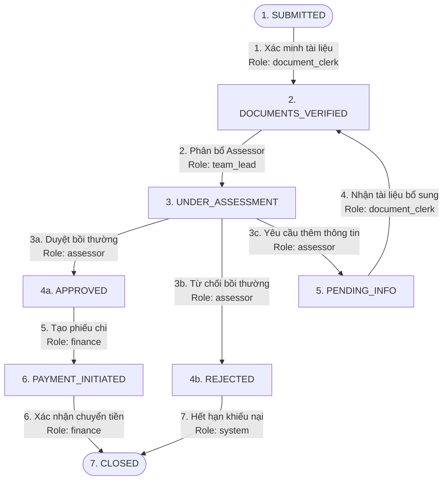

# Bộ Điều Phối Luồng Xử Lý Yêu Cầu Bồi Thường (Claims Workflow Orchestrator)

Bộ điều phối (engine) xử lý yêu cầu bồi thường bảo hiểm được xây dựng trên nền tảng **NestJS** và cấu hình chặt chẽ bằng **TypeScript**. Dự án sử dụng mô hình Máy Trạng Thái (State Machine) được định nghĩa hoàn toàn từ file cấu hình (config-driven) để quản lý vòng đời bồi thường, bảo đảm tính minh bạch, tuân thủ nghiệp vụ và ngăn ngừa gian lận.

---

## 🏢 Bối Cảnh Nghiệp Vụ (Business Logic & Flows)

Trong ngành bảo hiểm, một yêu cầu bồi thường (Claim) di chuyển qua các giai đoạn nghiệp vụ cực kỳ nghiêm ngặt nhằm tránh các rủi ro pháp lý hoặc thất thoát tài chính do gian lận. 

Hệ thống triển khai cơ chế **Phân chia Trách nhiệm (Segregation of Duties)**, kiểm tra **Điều kiện tiên quyết (Preconditions)** nghiêm ngặt tại mỗi bước chuyển trạng thái, đồng thời ghi lại **Nhật ký Kiểm toán Không thể Thay đổi (Immutable Audit Trail)**.



### 1. Mô Tả Luồng Trạng Thái Nghiệp Vụ
* **SUBMITTED (Đã Tiếp Nhận)**: Claim mới được tạo và lưu trữ trên hệ thống, chờ nhân viên hành chính xác minh tính hợp lệ của các hồ sơ/chứng từ đính kèm.
* **DOCUMENTS_VERIFIED (Hồ Sơ Hợp Lệ)**: Hồ sơ đã được kiểm tra đầy đủ. Trạng thái này là điều kiện cần trước khi chuyển giao cho bộ phận thẩm định chuyên sâu.
* **UNDER_ASSESSMENT (Đang Thẩm Định)**: Chuyên viên thẩm định (Assessor) kiểm tra chi tiết đơn thuốc, hóa đơn lâm sàng và so sánh với điều khoản hợp đồng bảo hiểm của khách hàng.
* **PENDING_INFO (Chờ Bổ Sung)**: Nếu hồ sơ thiếu (ví dụ: thiếu chữ ký bác sĩ), Assessor gửi yêu cầu bổ sung thông tin cho khách hàng. Trạng thái bồi thường sẽ tạm dừng thẩm định.
* **APPROVED (Đã Duyệt)**: Đơn bồi thường được Assessor phê duyệt chi trả do hồ sơ hợp lệ và chi phí nằm trong hạn mức hợp đồng.
* **REJECTED (Bị Từ Chối)**: Yêu cầu bị từ chối do nằm trong danh mục loại trừ bồi thường hoặc vi phạm điều khoản.
* **PAYMENT_INITIATED (Đã Lệnh Chi)**: Bộ phận kế toán/tài chính thực hiện giao dịch ngân hàng hoặc tạo lệnh chuyển khoản.
* **CLOSED (Đã Đóng)**: Kết thúc chu trình xử lý của yêu cầu bồi thường (có thể đóng sau khi chi trả xong, hoặc đóng sau khi từ chối và hết thời hạn khiếu nại).

---

## 📂 Cấu Trúc Thư Mục & Vai Trò Các File (Codebase Directory Structure)

Mã nguồn được tổ chức theo cấu trúc Modular của NestJS để đảm bảo tính cô lập, dễ đọc và dễ bảo trì rộng rãi. Dưới đây là sơ đồ hình cây và giải thích chi tiết vai trò của từng file:

```
claims-backend/
├── config/
│   └── workflow-config.json       # Định nghĩa máy trạng thái, vai trò, preconditions và side-effects (JSON)
├── src/
│   ├── main.ts                    # Điểm khởi chạy: Cấu hình CORS, Prefix, ValidationPipe, ExceptionFilter & Interceptor
│   ├── app.module.ts              # Module gốc lắp ráp toàn bộ các phân hệ con (Engine, Claims, Scenarios)
│   ├── app.controller.ts          # Controller kiểm tra sức khỏe hệ thống (Base Health Check)
│   ├── app.service.ts             # Service cung cấp dịch vụ gốc
│   │
│   ├── common/                    # Phân hệ tài nguyên dùng chung toàn cục
│   │   ├── filters/
│   │   │   └── http-exception.filter.ts   # Bộ lọc biệt lệ toàn cục: Bọc các lỗi HTTP thành JSON lỗi tiêu chuẩn
│   │   └── interceptors/
│   │       └── transform.interceptor.ts    # Bộ chuyển đổi toàn cục: Bọc các kết quả thành công thành JSON tiêu chuẩn
│   │
│   ├── engine/                    # Phân hệ lõi Máy trạng thái (Core Workflow Engine)
│   │   ├── engine.module.ts       # Xuất bản WorkflowEngineService & AuditTrailService để sử dụng chéo
│   │   ├── types.ts               # Định nghĩa tất cả TypeScript interfaces, DTOs & thực thể (Claim, AuditLog)
│   │   ├── workflow-engine.service.ts  # Thực thi kiểm soát phân quyền vai trò SoD, kiểm tra Preconditions đệ quy và cycleCount
│   │   └── audit-trail.service.ts # Kho lưu trữ nhật ký bất biến. Deep-freeze bản ghi log và nhân bản sao khi đọc chống sửa đổi
│   │
│   ├── claims/                    # Phân hệ quản lý đơn bồi thường (Claims Domain Module)
│   │   ├── claims.module.ts       # Đóng gói và liên kết phân hệ claims với Engine lõi
│   │   ├── claims.controller.ts   # Cung cấp các cổng REST API nghiệp vụ (Tạo mới, chuyển đổi, truy vấn chi tiết)
│   │   ├── claims.service.ts      # Quản lý kho lưu trữ Claim (trong bộ nhớ) và điều hành chuyển đổi trạng thái đơn
│   │   └── workflow.spec.ts       # Bộ spec tích hợp (17 ca thử nghiệm Jest) tự động kiểm tra chặt chẽ mọi góc nghiệp vụ
│   │
│   └── scenarios/                 # Phân hệ chạy giả lập kịch bản
│       ├── scenarios.module.ts    # Đóng gói phân hệ giả lập
│       ├── scenarios.controller.ts# Expose API để kích hoạt chạy và trả báo cáo giả lập kịch bản 1 đến 6
│       └── scenarios.service.ts   # Kịch bản lập trình từng bước thực thi đầy đủ 6 chu trình luồng thử nghiệm
```

---

## 🔒 Các Quy Tắc Nghiệp Vụ Cốt Lõi (Operational Rules)

### 1. Kiểm soát vai trò (Role-Based Authorization)
Hệ thống phân quyền chi tiết để đảm bảo không nhân viên nào có thể thực hiện thao tác vượt quá thẩm quyền chuyên môn:
* **`document_clerk` (Thư ký hồ sơ)**: Chỉ có quyền tiếp nhận hồ sơ đầu vào (`SUBMITTED -> DOCUMENTS_VERIFIED`) và xử lý hồ sơ bổ sung từ khách hàng (`PENDING_INFO -> DOCUMENTS_VERIFIED`).
* **`team_lead` (Trưởng nhóm thẩm định)**: Có thẩm quyền điều phối công việc và phân bổ thẩm định viên (`DOCUMENTS_VERIFIED -> UNDER_ASSESSMENT`).
* **`assessor` (Thẩm định viên)**: Người có chuyên môn y khoa/bảo hiểm thực hiện đưa ra kết luận phê duyệt, từ chối hoặc yêu cầu làm rõ hồ sơ (`UNDER_ASSESSMENT -> APPROVED / REJECTED / PENDING_INFO`).
* **`finance` (Kế toán tài chính)**: Người quản lý quỹ tiền mặt và ra lệnh chi trả (`APPROVED -> PAYMENT_INITIATED -> CLOSED`).
* **`system` (Hệ thống tự động)**: Chạy ngầm các cron-job hoặc sự kiện tính giờ như lưu trữ hồ sơ hoặc tự động đóng yêu cầu bị từ chối khi hết thời gian khiếu nại (`REJECTED -> CLOSED`).

### 2. Rào Cản Điều Kiện Tiên Quyết (Precondition Checking)
Trước khi đổi trạng thái, hệ thống bắt buộc các biến dữ liệu ngữ cảnh (Context Payload) phải thỏa mãn logic nghiệp vụ:
* **Khi Duyệt (`APPROVED`)**: Số tiền bồi thường thực tế (`claimAmount`) tuyệt đối **không được vượt quá** hạn mức chính sách bảo hiểm của thành viên (`policyLimit`). Đồng thời, báo cáo thẩm định (`assessmentReportComplete`) bắt buộc phải hoàn thành (`true`).
* **Khi Từ Chối (`REJECTED`)**: Bắt buộc phải nhập văn bản lý do từ chối cụ thể (`rejectionReason`) để hệ thống gửi thư từ chối minh bạch cho khách hàng.
* **Khi Yêu Cầu Bổ Sung (`PENDING_INFO`)**: Phải cung cấp mô tả chi tiết thông tin còn thiếu (`missingInfoDescription`) để khách hàng biết cần tải lên giấy tờ gì.

### 3. Cơ Chế Chống Lạm Dụng Yêu Cầu Bổ Sung (Cycle Detection Limit)
Tránh việc thẩm định viên cố tình kéo dài thời gian xử lý bằng cách liên tục yêu cầu khách hàng bổ sung hồ sơ vô hạn lần (gây trải nghiệm tệ và ảnh hưởng SLA chi trả).
* Vòng lặp: `UNDER_ASSESSMENT` ➔ `PENDING_INFO` ➔ `DOCUMENTS_VERIFIED` ➔ `UNDER_ASSESSMENT`.
* Mỗi lần chuyển từ `UNDER_ASSESSMENT` sang `PENDING_INFO`, hệ thống sẽ tăng biến `cycleCount` lên 1 đơn vị.
* **Tối đa chỉ cho phép 3 lần yêu cầu bổ sung hồ sơ**.
* Ở **lần thứ 4** thẩm định viên cố ý chuyển sang `PENDING_INFO`, hệ thống sẽ chặn giao dịch ngay lập tức và ném ra lỗi: 
  `"Maximum information requests exceeded — escalate to team lead"` (Vượt quá số lần yêu cầu thông tin tối đa — xin hãy chuyển lên Trưởng nhóm giải quyết).

### 4. Nhật Ký Kiểm Toán Bất Biến (Immutable Audit Trail)
Để phục vụ thanh tra cơ quan quản lý nhà nước và phòng chống gian lận nội bộ:
* Mọi thay đổi trạng thái đều sinh ra bản ghi lưu vết chi tiết: Mã ID log, mã Claim, thời gian chính xác, trạng thái cũ, trạng thái mới, thông tin người thực hiện (ID + Role), lý do thay đổi và toàn bộ dữ liệu context đầu vào.
* Bản ghi trong bộ nhớ được **đóng băng vĩnh viễn** (`Object.freeze()`).
* Không cung cấp bất kỳ API cập nhật hoặc xóa dữ liệu nghiệp vụ nào.
* Trả ra dữ liệu nhân bản (Deep Clone copy) để đảm bảo không mã nguồn nào bên ngoài có thể can thiệp sửa đổi dữ liệu gốc trong bộ lưu trữ.

---

## 📋 API & Định Nghĩa Kiểu Dữ Liệu (Payload Schemas)

Tất cả các API được bọc trong một **Vỏ bọc Định dạng Phản hồi Toàn cục (Unified Response Envelope)** nhằm đem lại sự thống nhất cho phía Client.

### 🌐 Cấu Trúc Khung Phản Hồi Toàn Cầu

#### Giao dịch Thành công (HTTP 2xx)
```json
{
  "success": true,
  "statusCode": 200,
  "message": "Operation completed successfully",
  "data": { ... } // Chứa tài nguyên dữ liệu trả về thực tế
}
```

#### Giao dịch Lỗi (HTTP 4xx / 5xx)
```json
{
  "success": false,
  "statusCode": 400,
  "timestamp": "2026-05-30T10:34:00.000Z",
  "path": "/api/claims/CLM-X901/transition",
  "message": "Mô tả lỗi chi tiết từ hệ thống hoặc mảng lỗi Validate DTO",
  "error": "Tên lỗi chuẩn (Bad Request, Forbidden, NotFound, vv.)"
}
```

---

### Chi Tiết Cổng API Nghiệp Vụ

#### 1. Tạo Mới Hồ Sơ Bồi Thường
Khởi tạo một hồ sơ mới. Trạng thái mặc định luôn là `SUBMITTED`.
* **Endpoint**: `POST /api/claims`
* **Dữ liệu gửi lên (`CreateClaimDto`)**:
  ```json
  {
    "claimId": "CLM-HANOI99", // Không bắt buộc, tự sinh nếu bỏ trống
    "metadata": {             // Các thông tin bổ sung tùy biến
      "patientName": "Nguyễn Văn A",
      "description": "Bồi thường nhổ răng khôn"
    }
  }
  ```
* **Dữ liệu nhận về (nằm trong trường `data`)**:
  ```json
  {
    "claimId": "CLM-HANOI99",
    "currentState": "SUBMITTED",
    "cycleCount": 0,
    "metadata": {
      "patientName": "Nguyễn Văn A",
      "description": "Bồi thường nhổ răng khôn"
    },
    "createdAt": "2026-05-30T10:00:00.000Z",
    "updatedAt": "2026-05-30T10:00:00.000Z"
  }
  ```

#### 2. Lấy Danh Sách Toàn Bộ Hồ Sơ
* **Endpoint**: `GET /api/claims`
* **Dữ liệu nhận về (`Claim[]`)**: Danh sách toàn bộ các yêu cầu bồi thường hiện có trong bộ nhớ.

#### 3. Xem Chi Tiết Hồ Sơ & Tính Toán Luồng Chuyển Tiếp Trạng Thái
API tự động phân tích trạng thái hiện tại của Claim để tính toán xem bước tiếp theo có thể đi đâu, cần vai trò nào kích hoạt, và các điều kiện tiên quyết cần gửi lên là gì.
* **Endpoint**: `GET /api/claims/:id`
* **Dữ liệu nhận về (nằm trong trường `data`)**:
  ```json
  {
    "claimId": "CLM-HANOI99",
    "currentState": "SUBMITTED",
    "cycleCount": 0,
    "metadata": { "patientName": "Nguyễn Văn A" },
    "createdAt": "2026-05-30T10:00:00.000Z",
    "updatedAt": "2026-05-30T10:00:00.000Z",
    "availableTransitions": [
      {
        "to": "DOCUMENTS_VERIFIED",
        "authorizedRoles": ["document_clerk"],
        "preconditions": [
          {
            "field": "allDocumentsPresent",
            "operator": "equals",
            "value": true,
            "errorMessage": "All required documents must be present"
          }
        ]
      }
    ]
  }
  ```

#### 4. Thực Hiện Chuyển Trạng Thái Yêu Cầu Bồi Thường
API cốt lõi để duyệt, từ chối, yêu cầu thông tin hoặc thực hiện lệnh chi.
* **Endpoint**: `POST /api/claims/:id/transition`
* **Dữ liệu gửi lên (`TransitionClaimDto`)**:
  ```json
  {
    "role": "document_clerk",          // Vai trò của người thực hiện thao tác
    "userId": "staff_clerk_01",         // Mã định danh nhân viên
    "toState": "DOCUMENTS_VERIFIED",   // Trạng thái đích muốn chuyển tới
    "reason": "Hồ sơ y tế đầy đủ",     // Lý do phê duyệt/ghi chú nghiệp vụ
    "context": {                       // Các cờ dữ liệu để vượt qua Preconditions
      "allDocumentsPresent": true
    }
  }
  ```
* **Dữ liệu nhận về (nằm trong trường `data`)**:
  ```json
  {
    "success": true,
    "claim": {
      "claimId": "CLM-HANOI99",
      "currentState": "DOCUMENTS_VERIFIED",
      "cycleCount": 0,
      "metadata": {
        "patientName": "Nguyễn Văn A",
        "allDocumentsPresent": true
      },
      "createdAt": "2026-05-30T10:00:00.000Z",
      "updatedAt": "2026-05-30T10:10:00.000Z"
    },
    "auditLog": {
      "id": "e44d32a0-8bb0-47b2-bdcf-856c4d7bb9f1",
      "claimId": "CLM-HANOI99",
      "timestamp": "2026-05-30T10:10:00.000Z",
      "fromState": "SUBMITTED",
      "toState": "DOCUMENTS_VERIFIED",
      "triggeredBy": { "userId": "staff_clerk_01", "role": "document_clerk" },
      "reason": "Hồ sơ y tế đầy đủ",
      "context": { "allDocumentsPresent": true }
    },
    "sideEffectsExecuted": ["notifyAssessorTeam"] // Các sự kiện phụ tự động kích hoạt
  }
  ```

#### 5. Truy Vấn Nhật Ký Kiểm Toán Của Một Claim
Truy cập đầy đủ lịch sử dịch chuyển trạng thái từ lúc sơ khai đến hiện tại. Nhật ký bảo đảm tính bất biến, không thể bị xóa hoặc sửa đổi.
* **Endpoint**: `GET /api/claims/:id/audit-trail`
* **Dữ liệu nhận về (`AuditLog[]`)**: Mảng lịch sử kiểm toán chi tiết của yêu cầu bồi thường đó.

---

## 🛠️ Cài Đặt & Khởi Chạy

### 1. Cài đặt thư viện phụ thuộc
```bash
npm install
```

### 2. Chạy thử nghiệm tự động (17 Kịch bản Test)
Kiểm tra toàn bộ logic nghiệp vụ (vòng lặp bổ sung hồ sơ, hạn mức số tiền, phân quyền vai trò, nhật ký bất biến):
```bash
npm run test
```

### 3. Khởi chạy Server Phát triển
Server sẽ chạy trên cổng **`3001`** (để dành cổng `3000` cho phía Next.js Frontend):
```bash
npm run start:dev
```
Địa chỉ Backend API: `http://localhost:3001/api/`
